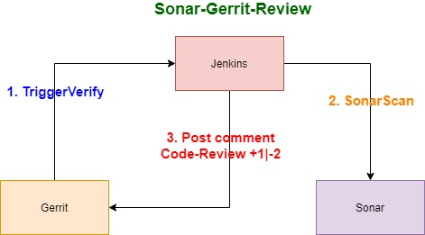

# Sonar-Gerrit-Review
  Fetch NewIssue from sonar server only for the code author. Convert to comments post to Gerrit.
 If no issue, Code-Review +1； Else Code-Review -2.

# Get Start
1. build docker image local, Or use online.
`docker build . -t wxdlong/sonar-gerrit-review -f docker/Dockerfile`

2. Run in jenkins.

```bash
docker run wxdlong/sonar-gerrit-review -gurl=${GERRIT_SERVER} -gcid=${GERRIT_CHANGE_ID}
-grid=${GERRIT_REVIEW_ID} -gname=${GERRIT_USERNAME} -gpwd=${GERRIT_PWD} 
-surl=${SONAR_SERVER} -sname=${SONAR_USERNAME} -spwd=${SONAR_PWD} -stask=${SONAR_TAKS_URL}
-sauthor=${SONAR_AUTHOR} -stimeout=${SONAR_TIMEOUT}
```

  stask: The url that after sonar scan, it will generator in sonar-report.txt.    
  sauthor: The author who commit the code.   
  stimeout: When fetch sonar result, it may timeout. The timeout = stimeout*30s    
 
# How to


